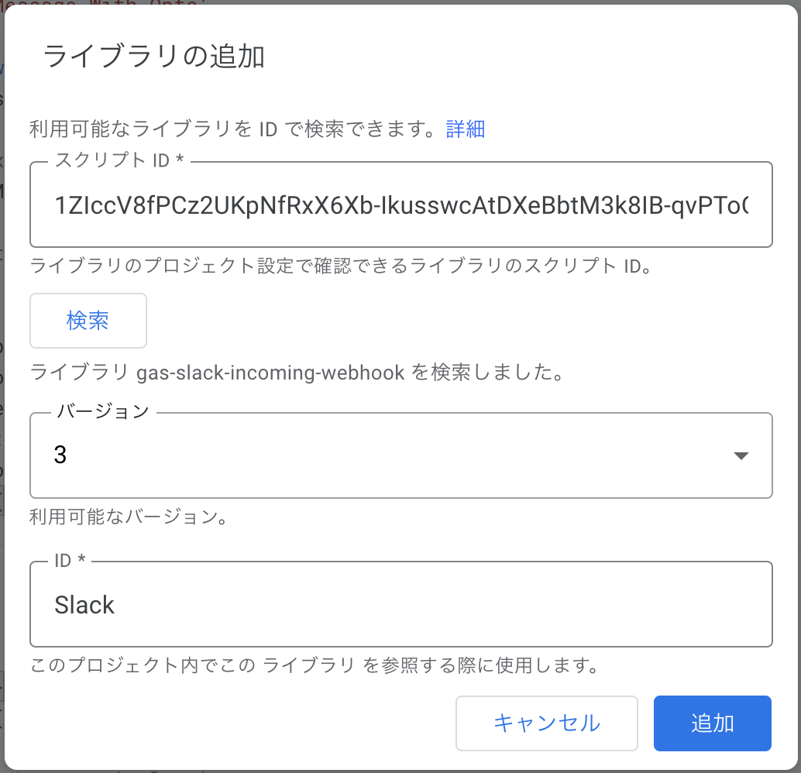

# Slack Incoming Webhook for GAS

[](https://github.com/google/clasp)

A Slack Incoming Webhook client for Google Apps Script.

This Libray is published as Library-ID `1ZIccV8fPCz2UKpNfRxX6Xb-IkusswcAtDXeBbtM3k8IB-qvPToCfPcfX`.

## Instalation

1. Create or Open your GAS project.
2. Cliock Add Library link, then Library daialog is opened.
   
3. Input `1ZIccV8fPCz2UKpNfRxX6Xb-IkusswcAtDXeBbtM3k8IB-qvPToCfPcfX` to *Script ID*, and click *Search* button. 
4. Select library version.
5. Change *ID* of this library to `Slack`
   
6. Click *Add* button.

## Usage

You can use this library in your google apps script, like the following code.

### Simple text

```javascript
function sendMessage() {
  var url = 'https://hooks.slack.com/services/your/incoming/webhooks/url'
  var webhook = new Slack.IncomingWebhook(url);
  webhook.send('Hello World!')
}
```

### Message with Options

```javascript
function sendMessageWithOpts() {
  const message: IncomingWebhookSendArguments = {
    channel: 'general',
    icon_emoji: ':ok:',
    username: 'Webhook for GAS',
    text: 'send Message With Opts',
  };
  const webhook = new Slack.IncomingWebhook(url);
  webhook.send(message);
}
```

You can use other message options of Slack Incoming Webhook API. 
See [Incoming Webhooks \| Slack](https://api.slack.com/incoming-webhooks)

## Development

### Requirements

- Node.js
- Yarn

### How to setup your project
1. Clone this ripository.
2. Install dependencies by `yarn install`
3. Create your GAS project, push code, and open web editor.
   ```console
   $ yarn clasp:create 
   $ yarn clasp:push
   $ yarn clasp:open
   ```

## Related Documents

- [Incoming Webhooks \| Slack](https://api.slack.com/incoming-webhooks#posting_with_webhooks)
- [@slack/webhook \- npm](https://www.npmjs.com/package/@slack/webhook)
- [node\-slack\-sdk/IncomingWebhook\.ts at master · slackapi/node\-slack\-sdk](https://github.com/slackapi/node-slack-sdk/blob/master/packages/webhook/src/IncomingWebhook.ts)

## LICEMSE
[MIT](LICEMSE)
